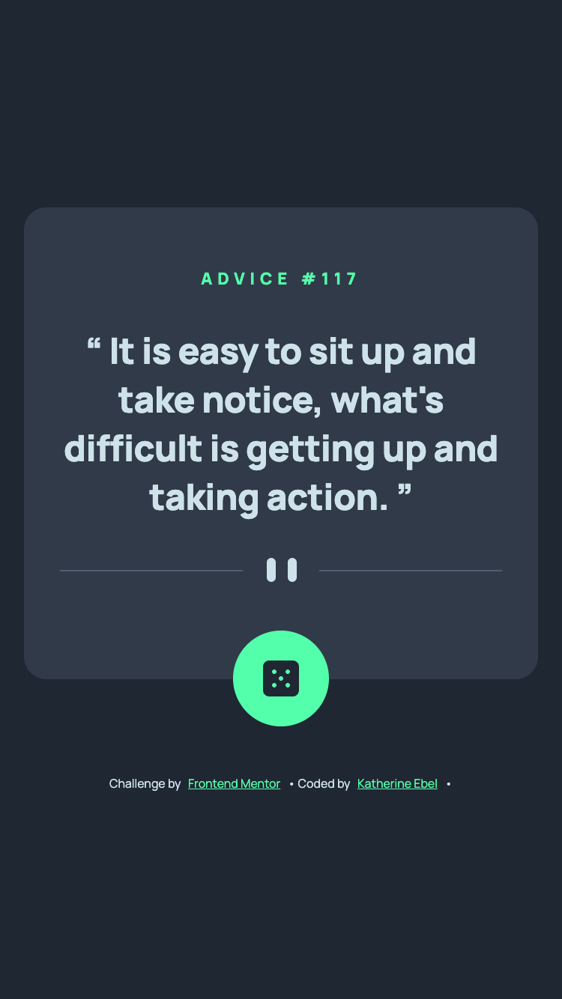
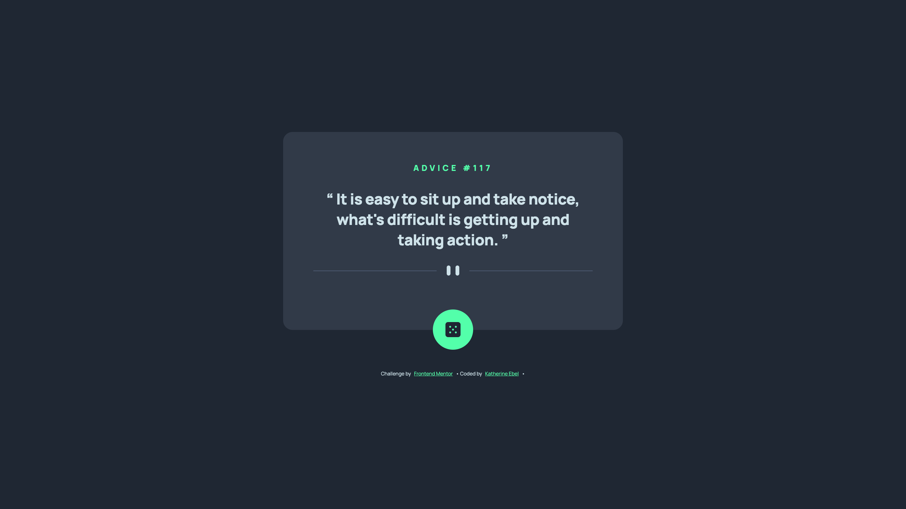
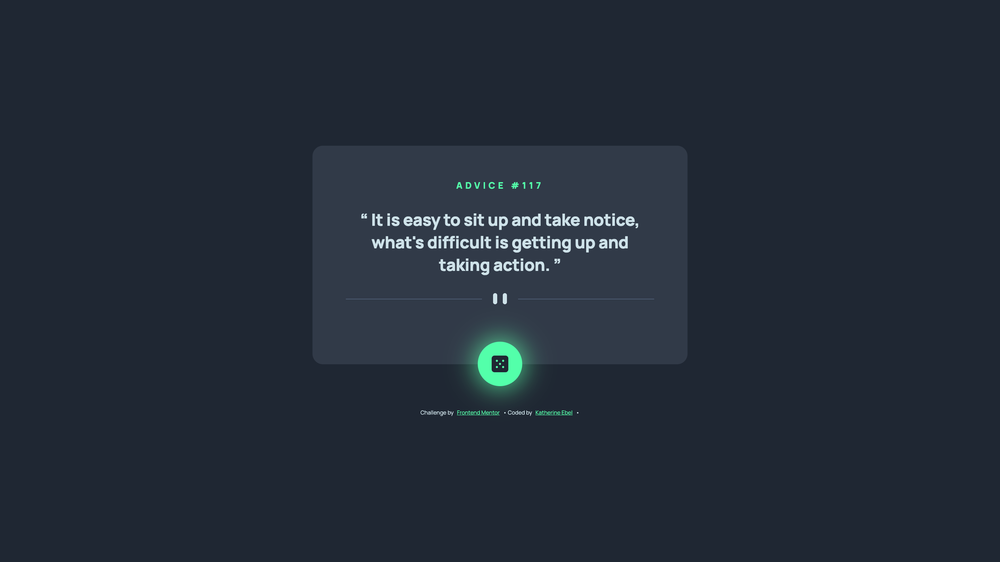

# Frontend Mentor - Advice generator app solution

This is a solution to the [Advice generator app challenge on Frontend Mentor](https://www.frontendmentor.io/challenges/advice-generator-app-QdUG-13db). Frontend Mentor challenges help you improve your coding skills by building realistic projects.

## Table of contents

- [Overview](#overview)
  - [The challenge](#the-challenge)
  - [Screenshot](#screenshot)
  - [Links](#links)
- [My process](#my-process)
  - [Built with](#built-with)
  - [Useful resources](#useful-resources)
- [Author](#author)

## Overview

### The challenge

Users should be able to:

- View the optimal layout for the app depending on their device's screen size
- See hover states for all interactive elements on the page
- Generate a new piece of advice by clicking the dice icon

### Screenshot

### Links

- Solution URL: [GitHub](https://github.com/KatherineEbel/fem-advice-generator-app)
- Live Site URL: [GitHub Page](https://katherineebel.github.io/fem-advice-generator-app/)

## My process

Built with Vanilla JS, HTML and CSS

### Built with

- Semantic HTML5 markup
- CSS custom properties
- Flexbox
- CSS Grid
- Mobile-first workflow

### Useful resources

- [Guide to Responsive Images](https://css-tricks.com/a-guide-to-the-responsive-images-syntax-in-html/) - This helped with the responsive pattern divider

## Author

- Frontend Mentor - [@KatherineEbel](https://www.frontendmentor.io/profile/KatherineEbel)
- Twitter - [@Kathy_Ebel](https://www.twitter.com/Kathy_Ebel)
